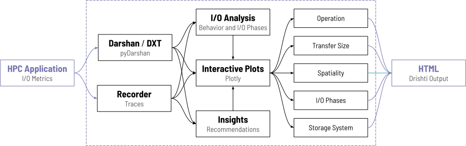

Drishti
===================================

**Dristhi** is a novel interactive web-based analysis framework to visualize I/O traces, highlight bottlenecks, and help understand the I/O behavior of scientific applications. Drishti aims to fill the gap between the trace collection, analysis, and tuning phases. The framework contains an interactive I/O trace analysis component for end-users to visually inspect their applications' I/O behavior, focusing on areas of interest and getting a clear picture of common root causes of I/O performance bottlenecks. Based on the automatic detection of I/O performance bottlenecks, our framework maps numerous common and well-known bottlenecks and their solution recommendations that can be implemented by users.

Drishti framework integrates initial efforts in visualization (DXT Explorer) and analysis (Drishti-I/O) into a single suite, extending and combining the capabilities of both tools while providing support for both Darshan and Recorder profiling and trace data. 

.. toctree::
   :maxdepth: 2
   :caption: Getting Started

   building

.. toctree::
   :maxdepth: 2
   :caption: Explorer

   exploring
   operation
   transfer
   spatiality
   rank-zero-workload
   unbalanced-ranks
   stragglers
   iophase
   ost-usage-operation
   ost-usage-transfer

.. toctree::
   :maxdepth: 2
   :caption: Insights

   insights

.. toctree::
   :maxdepth: 2
   :caption: Contribute

   instructions

.. toctree::
   :maxdepth: 2
   :caption: Legal

   citation
   copyright
   license
