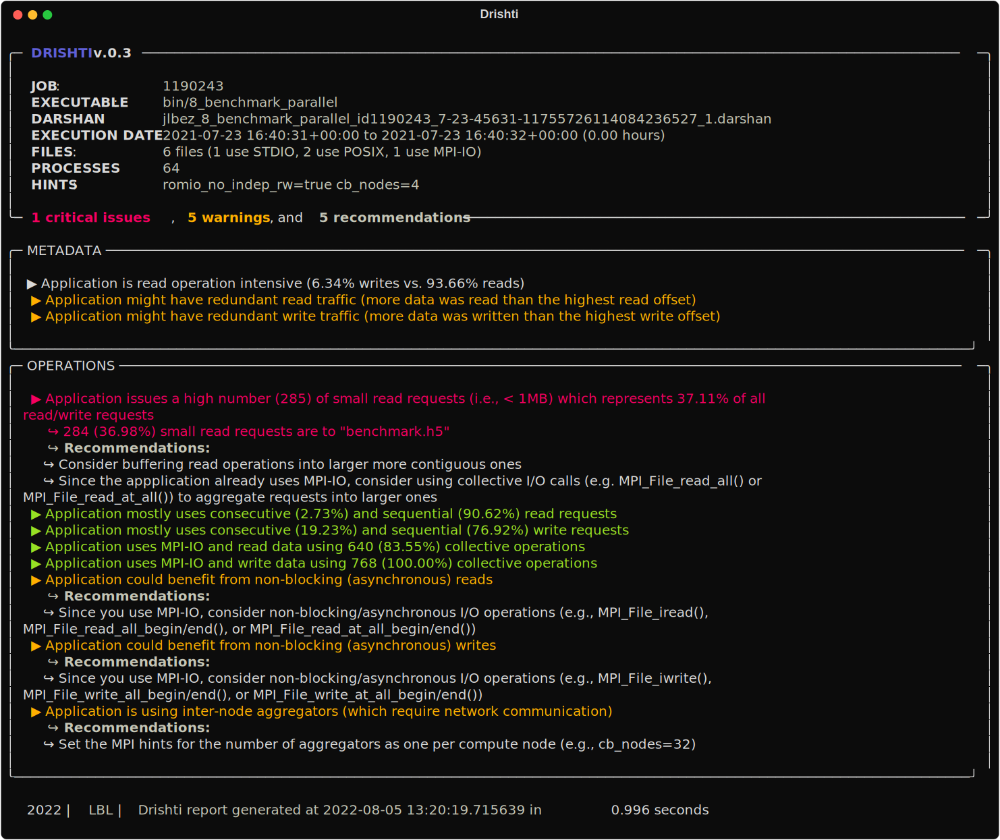
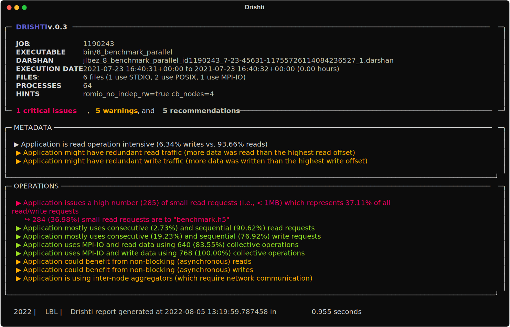
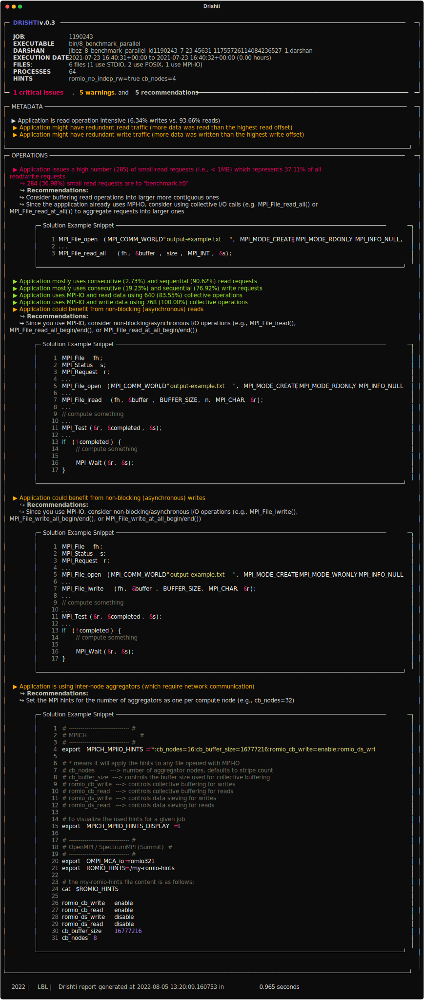

Insights and Recommendations
===================================

Drishti I/O is a command-line tool to guide end-users in optimizing I/O in their applications by detecting typical I/O performance pitfalls and providing a set of recommendations. You can get Drishti directly from pip:

.. code-block:: bash

    pip install drishti-io

To install Drishti I/O from scratch, make sure you have Python 3 and first install the dependencies:

.. code-block:: bash

    pip install -r requirements.txt
    pip install .

You can then run Drishti with the following options:

.. code-block:: bash

    usage: drishti.py [-h] [--issues] [--html] [--svg] [--verbose] [--code] darshan

    Drishti:

    positional arguments:
      darshan     Input .darshan file

    optional arguments:
      -h, --help  show this help message and exit
      --issues    Only displays the detected issues and hides the recommendations
      --html      Export the report as an HTML page
      --svg       Export the report as an SVG image
      --verbose   Display extended details for the recommendations
      --code      Display insights identification code

You can also use our Docker image:

.. code-block:: bash

    docker run --rm --mount type=bind,source="$(PWD)",target=/drishti drishti sample/jlbez_8a_benchmark_write_parallel_id1321662_8-21-5892-15802854900629188750_106.darshan

You can also use a Docker image already pre-configured with all dependencies to run Drishti:

.. code-block:: bash

    docker pull hpcio/drishti

Since we need to provide a Darshan log file as input, make sure you are mounting your current directory in the container and removing the container after using it. You can pass the same arguments described above, after the container name (drishti).

.. code-block:: bash

    docker run --rm --mount \
        type=bind,source="$(PWD)",target="/drishti" \
        drishti <FILE>.darshan

By default Drishti will generate an overview report in the console with recommendations:

You can also only list the issues detected by Drishti with `--issues`:

You can also enable the verbose mode with `--verbose` to visualize solution snippets:

